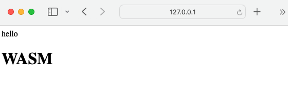

# 基于 golang 的打包 wasm 的 hello world

## 要求

1. [node 20.3.0](https://nodejs.org/en)
2. [golang 1.20.5](https://go.dev/dl/)

## 运行

打包 wasm

```bash
export GOOS=js
export GOARCH=wasm
go build -o main.wasm
```

安装前端依赖

```bash
npm install
```

运行

```bash
npm run dev
```

## 截图



## 参考资料

1. [【Go】【WebAssembly】【wasm】基于 go 打包的网页 wasm](https://juejin.cn/post/7133612627531399198)
2. [2022 年最新将 Go 打包成 wasm 体验](https://juejin.cn/post/7138611512339333128)
